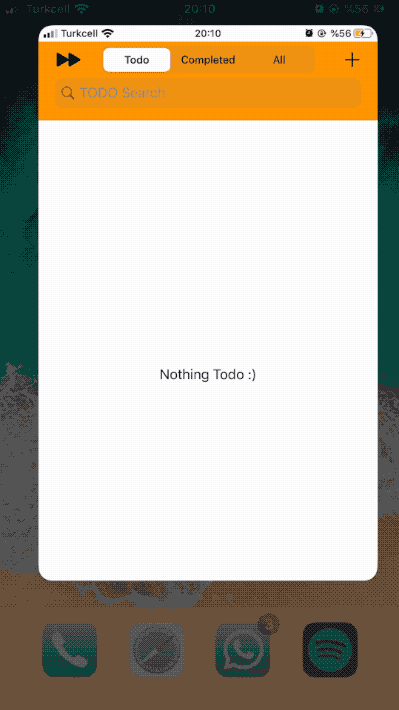

<p align="center">
 Simple Todo-App in Swift
</p>

## Content
- [App](#App)
- [Building and Running](#building-and-running)
- [Technologies](#technologies)


## App



## Building and Running
After you clone the repo, make sure that 
```sh
pod install
```

## Technologies
- [x] [SwiftLint](https://github.com/realm/SwiftLint) - A tool to enforce Swift style and conventions (well indented codes and warns about dirty code etc.)
- [x] [R.swift](https://github.com/mac-cain13/R.swift) - Get strong typed, autocompleted resources like images, fonts and segues in Swift projects (used easy typed segue purposes.)
- [x] [SegueManager](https://github.com/tomlokhorst/SegueManager) - Perform storyboard segues with closures, in Swift (easy type of using programmatic perform segues)
- [x] [Fakery](https://github.com/vadymmarkov/Fakery) - Swift fake data generator (used creating mock data for generating testing purposes.)
- [x] [Eureka](https://github.com/xmartlabs/Eureka) - Elegant iOS form builder in Swift (provides form which is so easy in Swift.)


